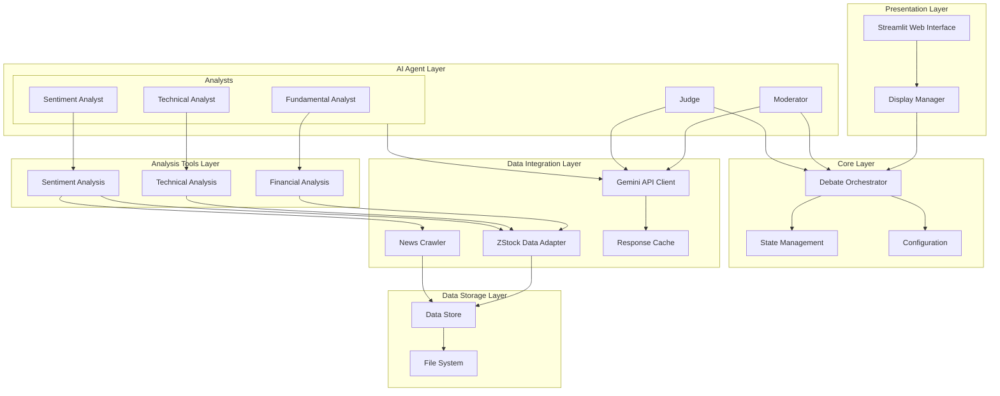
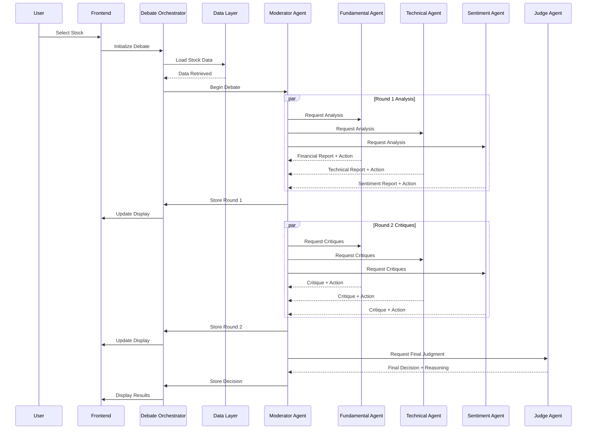
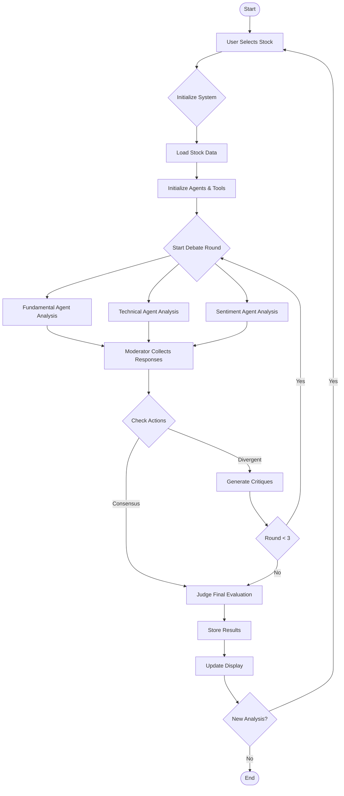

# Stock Debate AI - System Architecture

This document outlines the technical architecture of the Stock Debate AI system, which facilitates multi-agent debates for stock analysis using Gemini and AutoGen.

## System Overview

The system implements a multi-agent debate platform where different analyst agents (Fundamental, Technical, and Sentiment) discuss and analyze stocks, moderated by a Moderator agent and evaluated by a Judge agent.

## Component Architecture

## Sequence Diagram - Debate Flow

## Flow Chart - Message Processing

## Key Components

### Frontend Layer
- **Streamlit UI**: Handles user interaction and real-time display of debate progress
- **WebSocket Events**: Manages real-time updates and message streaming

### Orchestration Layer
- **Debate Orchestrator**: Coordinates agent interactions and manages debate flow
- **Session State**: Maintains debate context and agent states

### Agent Layer
- **Analyst Agents**: Specialized agents for different analysis types
- **Moderator**: Controls debate flow and ensures productive discussion
- **Judge**: Evaluates arguments and makes final decisions

### Integration Layer
- **Gemini Client**: Handles API communication with Google's Gemini model
- **ZStock Adapter**: Interfaces with stock data sources
- **News Crawler**: Gathers relevant news and sentiment data

### Storage Layer
- **File System**: Stores stock data and debate history
- **Response Cache**: Optimizes performance by caching model responses

## Implementation Details

### Agent Communication
- Asynchronous message passing between agents
- Structured debate format with clear roles
- State management for action tracking

### UI Features
- Real-time message updates
- Action status tracking (BUY/SELL/HOLD)
- Critique linking between messages
- Auto-scrolling message view

### Data Flow
1. User selects stock and timeframe
2. System loads relevant data
3. Agents perform analysis in parallel
4. Moderator manages debate progression
5. Judge evaluates final consensus
6. Results displayed in UI

## Technical Stack
- Python 3.13
- Streamlit
- Google Gemini AI
- AutoGen Framework
- WebSocket Protocol
- File-based Storage

## Development Considerations
- Modular design for easy extension
- Asynchronous processing for responsiveness
- State management for debate tracking
- Error handling and recovery
- Performance optimization through caching